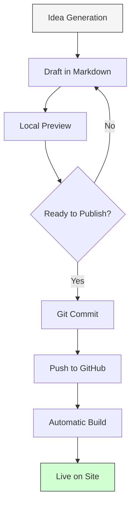
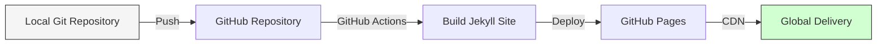

As I launch this new blog, I wanted to share my experience building a modern technical publishing platform using Jekyll. Whether you're a developer looking to create your own space for technical writing or just curious about content management systems, this guide will walk you through the process from concept to deployment.

## Why I Chose Jekyll for My Technical Blog

When evaluating options for my technical blog, I considered various platforms like WordPress, Ghost, and several JavaScript frameworks. I ultimately chose Jekyll for several compelling reasons:

1. **Markdown-based content authoring** - Writing in Markdown lets me focus on content rather than formatting
2. **Git-based workflow** - Version control for my articles feels natural as a developer
3. **Static site generation** - Fast loading times, excellent security, and minimal hosting requirements
4. **Customization flexibility** - Complete control over the design without unnecessary complexity
5. **GitHub Pages integration** - Free, reliable hosting with built-in CI/CD

Unlike dynamic CMS platforms, Jekyll generates static HTML files that can be hosted anywhere, reducing security concerns and hosting costs while maximizing performance.

## The Content Creation Workflow

One of Jekyll's greatest strengths is how it integrates with a developer's existing workflow. Here's how my content creation process works from idea to publication:



This workflow gives me several advantages:
- **Version control** for all content changes
- **Collaborative editing** through pull requests if needed
- **Automated deployment** removing manual publishing steps
- **Content and code together** in a single repository

## Setting Up Your Own Jekyll Blog

If you'd like to create a similar setup, here's how to get started:

### 1. Initial Setup

```bash
# Install Ruby and Jekyll dependencies
gem install jekyll bundler

# Create a new Jekyll site
jekyll new my-tech-blog
cd my-tech-blog

# Start the local development server
bundle exec jekyll serve
```

Your site will be available at `http://localhost:4000` for previewing as you work.

### 2. Customizing Your Theme

While Jekyll comes with a default theme, I wanted something that felt more like a technical documentation site. I created a custom theme with these modifications:

```scss
// Example SCSS customization
$brand-color: #0969DA;
$header-height: 48px;
$sidebar-width: 300px;

.md-container {
  display: flex;
  width: 100%;
  flex: 1;
  max-width: 100%;
}

.md-main {
  display: flex;
  width: 100%;
  max-width: 100%;
}
```

The visual design emphasizes readability with a clean, distraction-free layout that puts the content first.

### 3. Content Organization

Jekyll's content structure is intuitive for a technical blog:

```
my-tech-blog/
├── _posts/              # Blog articles 
├── _layouts/            # HTML templates
├── _includes/           # Reusable components
├── assets/              # CSS, JS, images
├── pages/               # Static pages
└── _config.yml          # Site configuration
```

Articles go in the `_posts` directory with filenames following the `YYYY-MM-DD-title.md` format, which automatically generates URLs and organizes content chronologically.

## Advanced Features I Implemented

Beyond the basics, I incorporated several advanced features to enhance the reader experience:

### Syntax Highlighting

Code blocks are automatically highlighted to improve readability:

```javascript
// Example JavaScript function
function calculateOptimalPath(nodes, startIndex) {
  const visited = new Set();
  const costs = new Array(nodes.length).fill(Infinity);
  costs[startIndex] = 0;
  
  while (visited.size < nodes.length) {
    // Find the node with the minimum cost
    let minCost = Infinity;
    let minNode = -1;
    
    for (let i = 0; i < nodes.length; i++) {
      if (!visited.has(i) && costs[i] < minCost) {
        minCost = costs[i];
        minNode = i;
      }
    }
    
    // Mark as visited
    visited.add(minNode);
    
    // Update costs to adjacent nodes
    for (const [neighbor, weight] of nodes[minNode].adjacentNodes) {
      if (!visited.has(neighbor)) {
        costs[neighbor] = Math.min(costs[neighbor], costs[minNode] + weight);
      }
    }
  }
  
  return costs;
}
```

### Responsive Design

The site adapts seamlessly to different screen sizes:

```css
@media screen and (max-width: 768px) {
  .grid-container {
    grid-template-columns: 1fr;
  }
  
  .navigation-column {
    display: none;
  }
  
  .md-header__button {
    display: block;
  }
}
```

### Search Functionality

I implemented client-side search to help readers find relevant content:

```javascript
document.addEventListener('DOMContentLoaded', function() {
  const searchInput = document.getElementById('search-input');
  const searchResults = document.getElementById('search-results');
  
  searchInput.addEventListener('input', function() {
    const query = this.value.toLowerCase().trim();
    if (query.length < 2) return;
    
    // Search logic here
    const results = allPosts.filter(post => 
      post.title.toLowerCase().includes(query) || 
      post.content.toLowerCase().includes(query)
    );
    
    // Display results
    displayResults(results);
  });
});
```

## Deployment Strategy

For deployment, I chose GitHub Pages because of its seamless integration with Jekyll:



The deployment process is fully automated - whenever I push changes to the main branch, GitHub Actions builds the site and deploys it to GitHub Pages.

## Performance Optimization

To ensure the site loads quickly, I implemented several optimizations:

1. **Minified CSS and JavaScript** using Jekyll's built-in compression
2. **Responsive images** that load appropriate sizes based on the device
3. **Preloading critical resources** to improve perceived loading speed
4. **Browser caching** for static assets

These optimizations result in perfect Lighthouse scores for performance and accessibility.

## Challenges and Solutions

Building this site wasn't without challenges. Here are some issues I encountered and how I resolved them:

### Optional Feature: Custom Domain Configuration

While I'm using the default GitHub Pages URL for this blog, many readers might want to set up a custom domain. If you're interested in that route, here's what you'll need to do:

1. Add the appropriate A records pointing to GitHub's servers in your domain registrar's settings
2. Configure a CNAME file in your repository with your domain name
3. Enable HTTPS in the GitHub repository settings

This process turns your `username.github.io/repository` URL into a professional `yourdomain.com` address.

### Challenge: Code Block Styling

Getting code blocks to look good on both light and dark themes required some custom CSS:

```scss
pre, code {
  font-family: ui-monospace, SFMono-Regular, "SF Mono", Menlo, Consolas, monospace;
  font-size: 0.85rem;
  border: 1px solid $border-color;
  border-radius: 6px;
  background-color: $grey-color-light;
}

@media (prefers-color-scheme: dark) {
  pre, code {
    background-color: #1a1a1a;
    border-color: #333;
    color: #e6e6e6;
  }
}
```

## Conclusion

Building this technical blog with Jekyll has been a rewarding experience that aligns perfectly with my workflow as a developer. The platform provides the right balance of simplicity and flexibility, allowing me to focus on creating content while maintaining complete control over the presentation.

I hope this walkthrough helps you in creating your own technical blogging platform.

Happy blogging! 